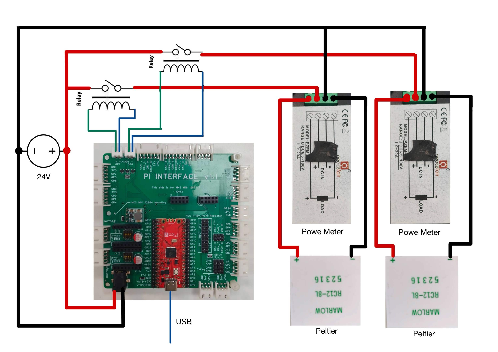

## 🚀Project Overview

The core objective of this project is to bridge the gap between theoretical thermodynamics and visual observation. While traditional heat transfer labs rely on numerical data from thermometers, this setup provides a **real-time visual heatmap** of thermal energy moving through solid mediums.

By toggling high-current Peltier (Thermo-Electric Cooler) modules through a relay interface, we can rapidly induce temperature differences ($\\\\Delta T$) across various materials (aluminum, copper, acrylic) and observe transient and steady-state thermal behavior.

---

## 🛠️ Hardware Stack

| Component | Description |
| :--- | :--- |
| **Peltier Modules** | 2x RC12-8L (or similar) for heating and cooling. |
| **Relay Module** | Dual-channel relay to handle high-current switching. |
| **Power Meter** | 2x for measure current and voltage|
| **Microcontroller** | Raspberry Pi Pico (for logic control). |
| **Thermal Camera** | Seek Thermal for visualization. |
| **Power Supply** | 24V DC (sufficient for Peltier current draw). |
| **Heatsinks** | Aluminum fins/fans to manage the "waste" side of the Peltier. |

---

## ⚙️ How It Works

### 1. Thermal Gradient Creation
The microcontroller executes logic to trigger relays, which provide power to the Peltier modules. One Peltier acts as the **Heat Source**, while the other acts as the **Heat Sink**.

### 2. Conductive Transfer
The modules are coupled to a conductive specimen (e.g., a metal bar). Thermal energy flows from the high-temperature Peltier to the low-temperature Peltier through the material.

### 3. Visualization & Analysis
As the heat moves, the **Thermal Camera** captures infrared radiation. This allows for the visual demonstration of **Fourier’s Law of Heat Conduction**:

$$q = -k \\\\nabla T$$

Where:
* $q$ = Local heat flux ($W/m^2$)
* $k$ = Material's thermal conductivity ($W/m\\\\cdot K$)
* $\\\\nabla T$ = Temperature gradient ($K/m$)

---

## 📸 Key Features

* **Real-Time Thermal Mapping:** Observe heat "flowing" through solid objects rather than just reading numbers.
* **Relay-Controlled Logic:** Managed duty cycles to prevent Peltier burnout and optimize power consumption.
* **Material Comparison:** Easily swap test specimens to see how different thermal conductivities ($k$) affect heat distribution speed.
* **Automated Cycles:** Scripted heating/cooling cycles for repeatable experimental results.

---

## :electric_plug:Wiring Diagram 

